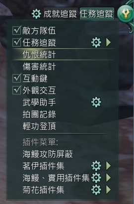
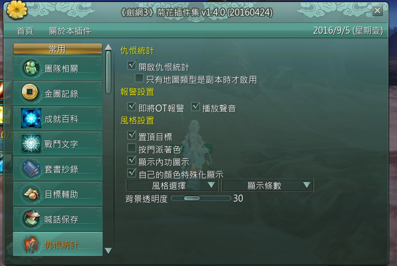

# T

## 仇恨

### 仇恨列表

仇恨列表有兩種，開啟方式如下圖:

* 官方提供



* JH提供 (建議使用)



### 仇恨機制

* 注意事項

若需保持一仇、避免OT須注意以下幾項:
1. 確保非點名階段其他人仇恨低於80%
2. 點名階段確保自己於2仇，並仇恨值大於120%
3. 若以上幾點無法做到，則點名階段結束時使用強仇技能

強仇技能請見[技能](#技能)部分。

#### 正常仇恨

|仇恨%數|線條化|順序|人名|
|:---|:---|---|---|
|100%|----------|1|A|
|20% |--|2|B|
|10% |-|3|C|

#### 一般OT

`無特殊階段，非一仇的仇恨值超過120%`

當非1仇的人仇恨超過120%，王就會轉目標為該人

|仇恨%數|線條化|順序|人名|
|:---|:---|---|---|
|100%|----------|1|A|
|120%|------------|2|B|

會立即變成下圖

|仇恨%數|線條化|順序|人名|
|:---|:---|---|---|
|100%|----------|1|B|
|84% |--------|2|A|

#### 轉目標後OT

`點名階段前，非一仇的仇恨超過100%`

當非1仇的人仇恨超過100%，但未到120%，王結束強制點名階段後，就會轉目標為該人

|仇恨%數|線條化|順序|人名|
|:---|:---|---|---|
|100%|----------|1|A|
|110%|-----------|2|B|
|10% |-|3|C|

點名階段 (假設點名C)

|仇恨%數|線條化|順序|人名|
|:---|:---|---|---|
|100%|-|1|C|
|1100%|-----------|2|B|
|1000%|----------|3|A|

點名階段結束

|仇恨%數|線條化|順序|人名|
|:---|:---|---|---|
|100%|----------|1|B|
|90% |---------|2|A|
|9%  |-|3|C|

#### 轉目標OT

`點名階段前，非一仇的仇恨超過83%，並於點名階段點名該人，且點名階段結束前坦仇恨未到120%`

|仇恨%數|線條化|順序|人名|
|:---|:---|---|---|
|100%|----------|1|A|
|90% |---------|2|B|

點名階段 (點名B)

|仇恨%數|線條化|順序|人名|
|:---|:---|---|---|
|100%|----------|1|B|
|110%|-----------|2|A|

若A一直未將仇恨加至120%，則點名階段結束後王會繼續打B。

#### 轉目標過程中OT

`點名階段內，非坦人員成為二仇且仇恨超過120%`

類似於[轉目標後OT](轉目標後OT)，不另外製圖。


## 技能

### 強仇技能

#### 極樂引

`群仇技能。固定一仇 4 秒，30 尺內免仇 6秒，並使自己造成的仇恨提高 100%。`

#### 慈悲願

`固定一仇 3 秒`

#### 朝聖言

`固定一仇 8 秒`

可以參考這個[連結](http://tieba.baidu.com/p/4548463174?see_lz=1) ([備份](other.md))。

### 減傷技能

### 建仇技能

### 技能循環


## 屬性


## 巨集

### 常用

注意：烈日斬額外加 5% 內外防秘籍 用宏之前看下這本秘籍讀了沒！

```
/cast 心火嘆
/cast 淨世破魔擊
/cast [moon>sun] 銀月斬
/cast [moon>sun|buff:魂‧日|sun<11&buff:明力] 幽月輪
/cast [sun>moon] 烈日斬
/cast 戒火斬
/cast 赤日輪
```

### 生死劫

```
/cast 心火嘆
/cast 生死劫
/cast [moon>sun] 銀月斬
/cast [moon>sun|buff:魂‧日|sun<11&buff:明力] 幽月輪
/cast [sun>moon] 烈日斬
/cast 戒火斬
/cast 赤日輪
```