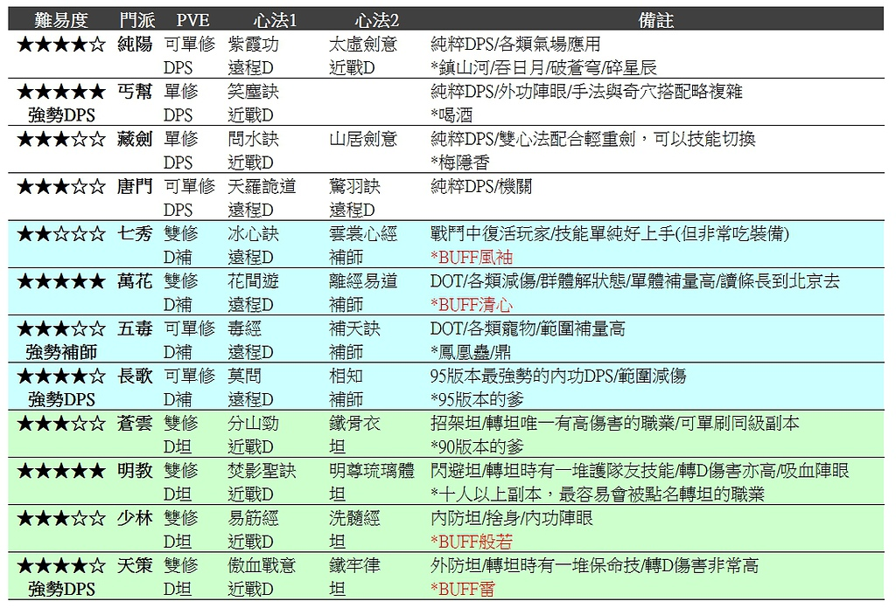

# 入門介紹

**以下內容皆為複製。**

## 心法介紹

|難易度|門派|PVE|心法1|心法2|備註|
|---|---|---|---|---|---|
|5.0|明教|雙修 D坦|焚影聖訣 進戰D|明尊琉璃體 坦|閃避坦/轉坦時有一堆護隊友技能/轉D傷害亦高/吸血陣眼 *十人以上副本，最容易會被點名轉坦的職業*|
|4.5|純陽|可單修 DPS|紫霞功 遠程D|太虛劍意 進戰D| 純粹DPS/各類氣場應用 *鎮山河/吞日月/破蒼穹/碎星辰* |